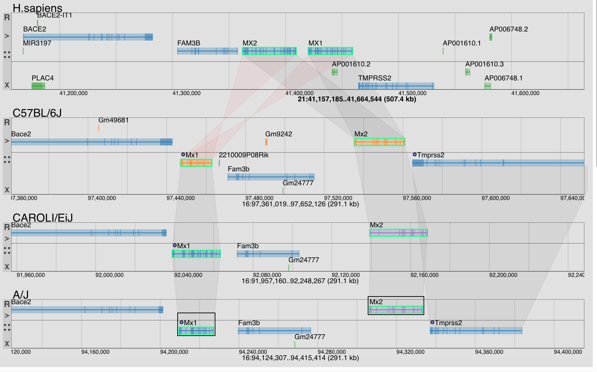

# mgv by IMGT

The Multiple Genome Viewer (MGV) supports comparative, simultaneous browsing of multiple genomes.



## License

Changed under IMGT license, the initial project is [mgv](https://github.com/mgijax/mgv), under MIT license.

The copyright notice **shall be conserved** as *License change and code modification is allowed under this license*.

By [IMGT lab](https://imgt.org).


## Installation

### Project setup

```
npm install
```

You (normally) only have to do it when you change dependancies. You can also update dependancies when needed.

```
npm update
```

### Starting on IMGT server

```
./server.sh
```

It will build the project (for production) and will give execution rights to cgi scripts. You will need write access to the dist and public folder.

### Compiles and hot-reloads for development

```
npm run serve
```

### Compiles and minifies for production

```
npm run build
```

### Run your tests

```
npm run test
```

### Lints and fixes files

```
npm run lint
```
